## Task 4.1

### Module 4 Linux Essentials

### Task1.Part1

2. Changing password using passwd command  
  
Basic parameters of the command are:  
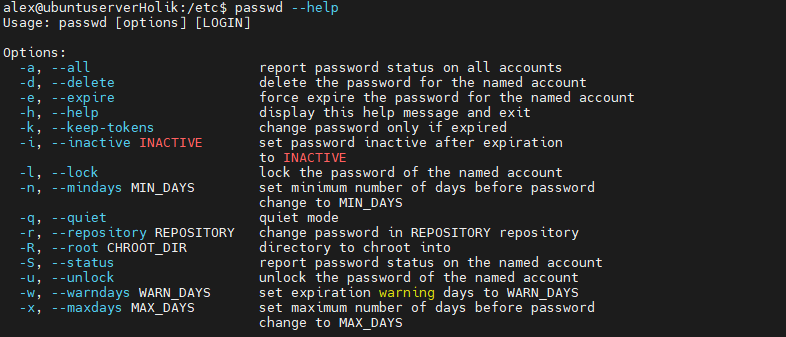  
This command interacts with these files:  
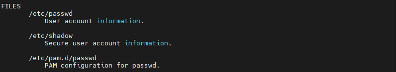  
The encrypted password is stored in the second column of the /etc/shadow file

3. We can use w command to show who is logged in and what users are executing.  
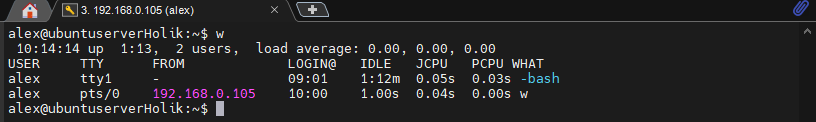  
The information in the output shows:  
Header - the current time, uptime of the device, the number of logged-in users, and system load averages  
Table output - name, name of tty, the remote host, login time, idle (how long is this process running), JCPU(time used by all processes of tty), PCPU(time used by the current process)  
4. To change personal information we use chfn command  
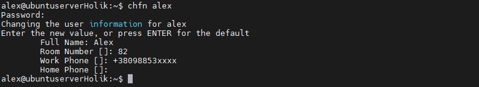
5. Linux help system  
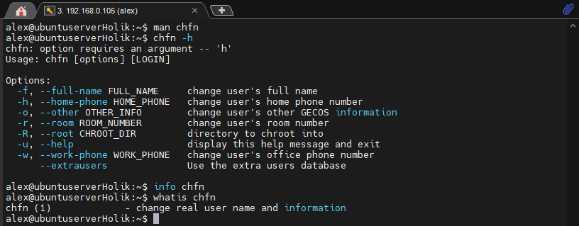  
We can modify the behavior of the commands using options. For example, we can modify w command by using -h key. That will hide header (-h) if we do not need it  
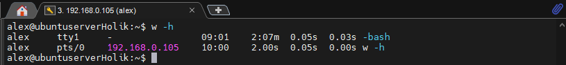  
We can set expiration warning days using "passwd -w 3 username" command  
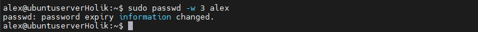  
6. more and less  
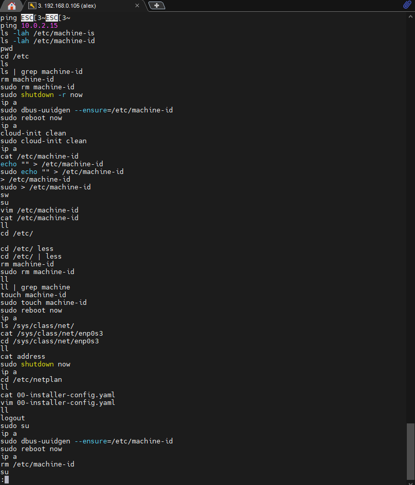  
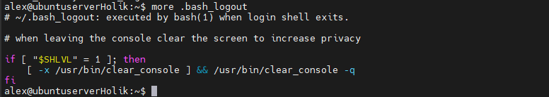  
7. To determine the last logon time for all users - lastlog command  
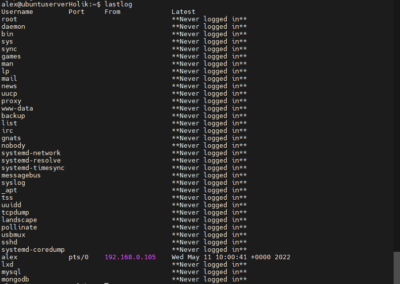  
Also, we can see the login history using "last" command  
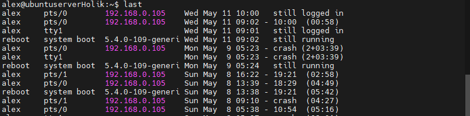  
The finger command also can display information about login time  
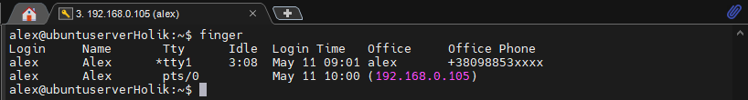
8. ls is used with additional key almost all the time. My personal preference is combination of -lah. The default system alias ll is used a lot too.  
The directories can be defined by letter "d" in the first column. Hidden files names start with dot "."  
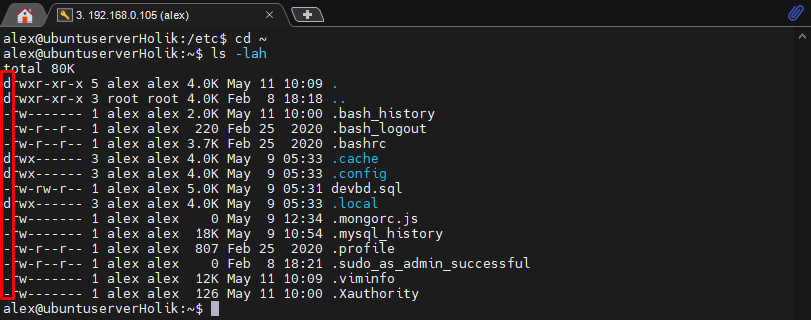
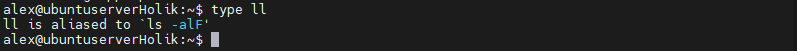

### Task1.Part2
1. Tree command  
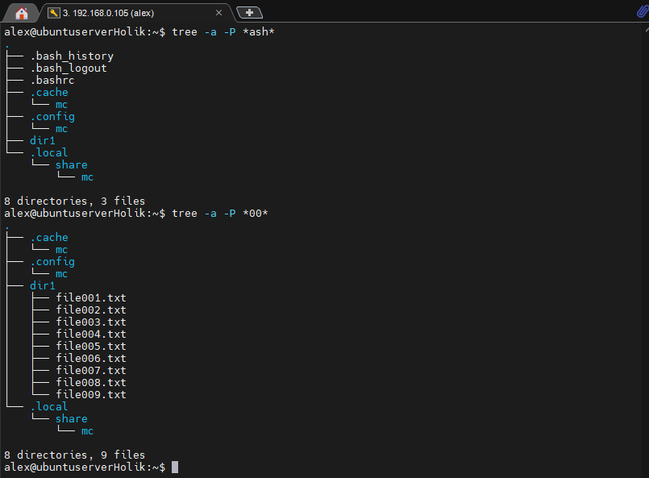
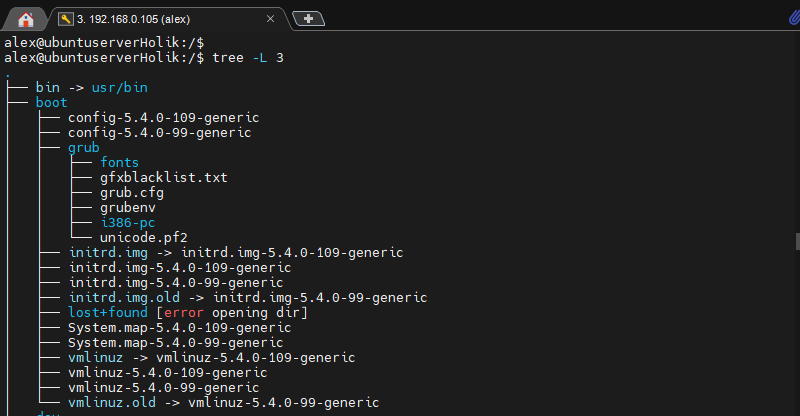  
2. To define the type of some file we can use file command. Examples:  
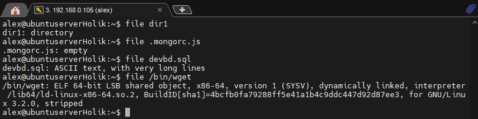
3. Relative and absolute paths:  
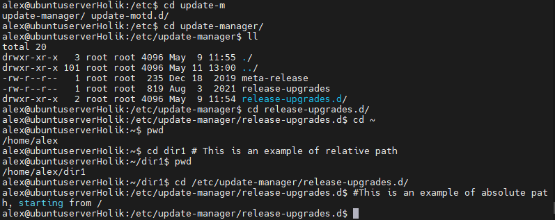  
To go to home directory from any place we use command cd ~
4. ls command  
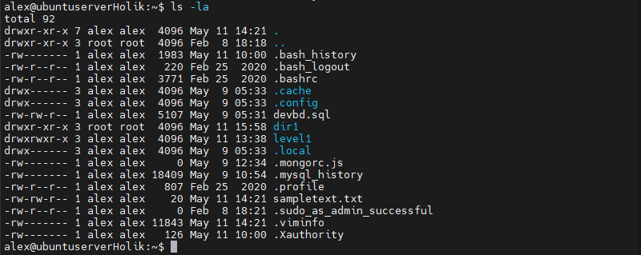  
Here we can see file some columns:
   * fype at the first place
   * next one is a permission block
   * number of hard links to the file
   * owner name
   * owner group
   * file size
   * date and time of last modification of the object
   * name
5. During this task I've used these commands:
   * ls -d */ > ~/task5/dirs_in_root redirected output of directories to the file
   * mkdir task5 - to create directory
   * cp /home/alex/task5/dirs_in_root ~ to copy the file
   * rm -ri ~/task5/ to remove the directory with files I have used -r recursive key and -i for confirmation of deleting every file
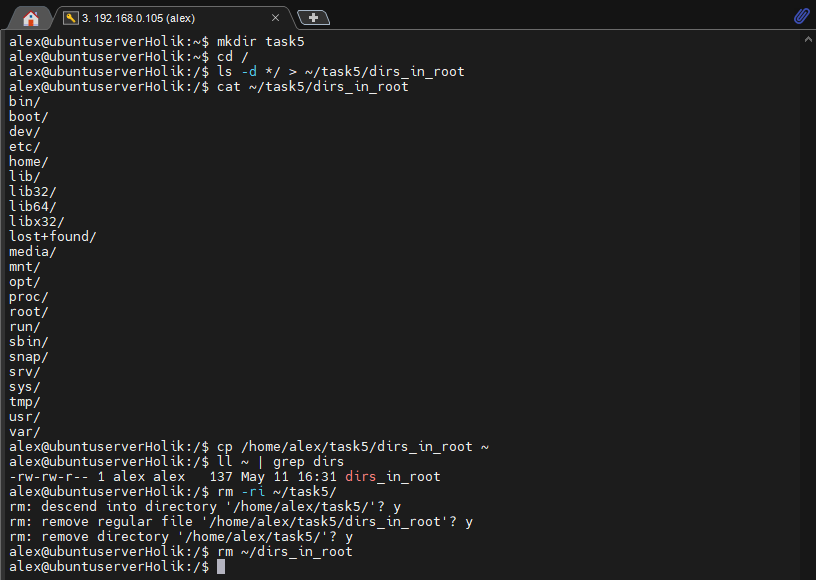  
6. Hard and soft links  
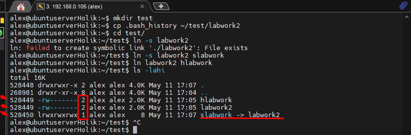  
A hard link is a mirror copy of the original file, the size is the same, files are "syncronized". Same inode number and permissions  
A soft link is a special sort of file that points at a different file. Different inode number and permissions. It has only the path to the original file, not the contents  
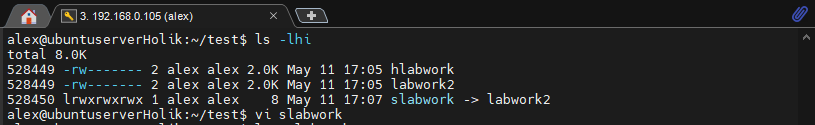  
When I have changed data by opening a symbolic link, the changes appeared in the originating file, because the link points the original file  
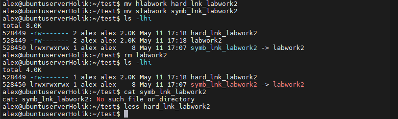  
When we delete the originating file, the symbolic link does not work because it is just a link.  
The hard link works perfectly and it has the actual contents of original file.
7. 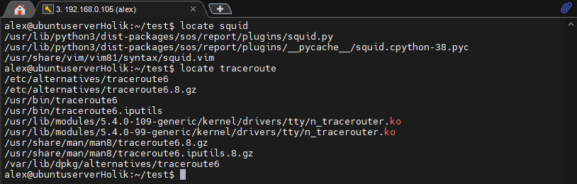 
8. To determine types of partitions we can use df -T (print file system type) or mount command  
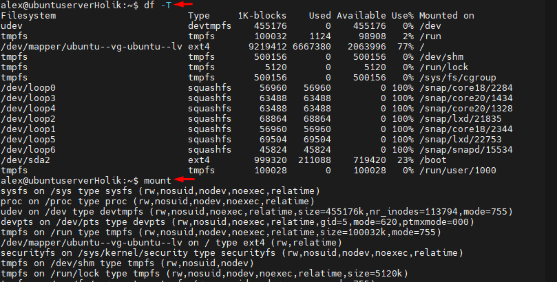 
9. To count the number of lines cointaining a given sequence of characters in a file we can use grep -c command:  
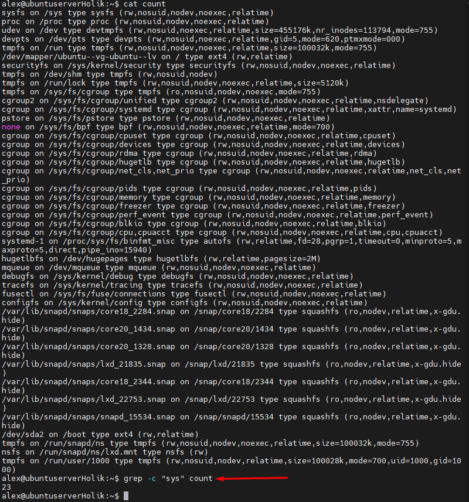  
10. Using find command we can find all files in /etc containing "host"  
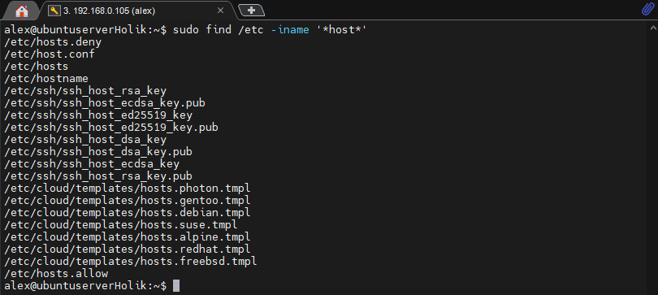
11. List all objects in /etc that contain the ss character sequence  
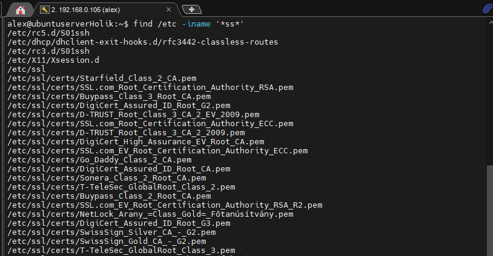
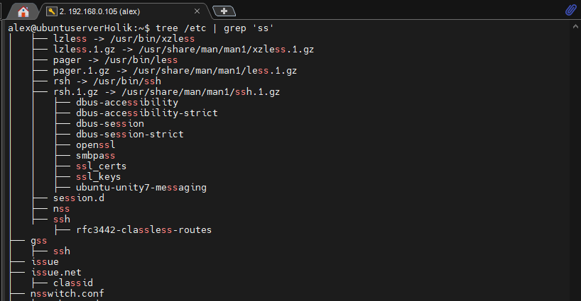
12. Screen-by-screen output of /etc directory  
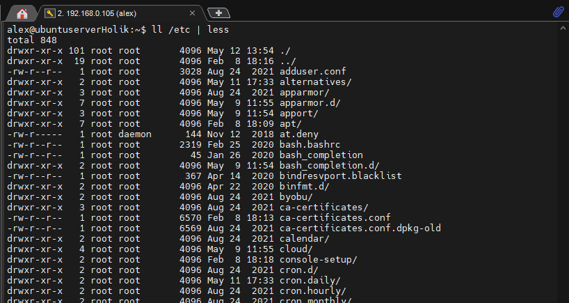 
13. Types of devices and how to determine the type of the device
There are actually two types of device files: 
* A block device is read or written one block (a group of bytes) at a time; 
* A character device can be read or written one byte at a time.  
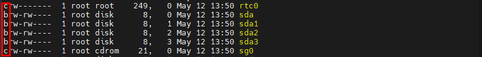  
The character b at the start of the ls output indicates that sda, sda1, sda2, sda3 are block devices 
rtc0, sg0 are character devices.
14. There are 7 types of files:
* Regular files [symbol -]
* Directories [symbol d]
* Character device files [symbol c]
* Block device files [symbol b]
* Local domain sockets [symbol s]
* Named pipes (FIFOs) [symbol p]
* Symbolic links [symbol l]
To determine the type of file we can use file command
15. To list first 4 directory files that were recently accessed in the /etc dir:  
find . - because we are already in /etc directory  
-type d - to list directories  
-amin -200 - random value in minutes e.g "recenty"  
and finaly we piping the result to head command to limit the output  
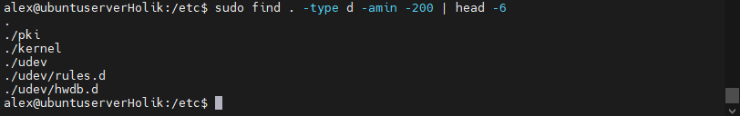
