## Task 4.2

### Module 4 Linux Essentials

### Task 2

1. /etc/passwd and /etc/group files  
**/etc/passwd**
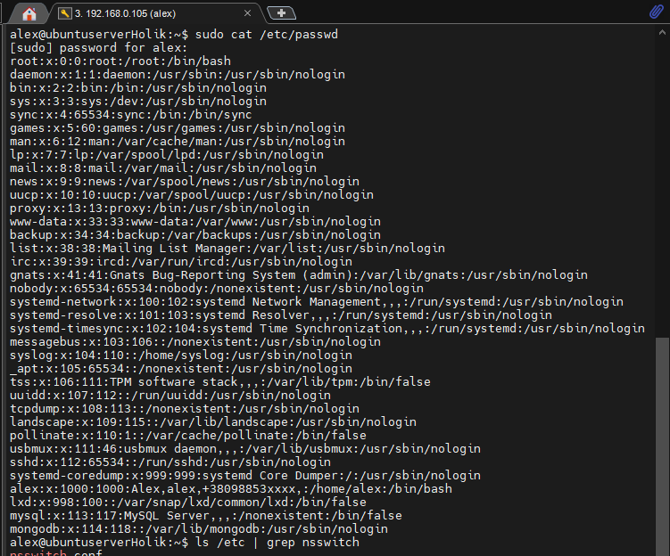  
/etc/passwd is a list of users recognized by the system.  
Each line in the file represents one user and contains seven fields separated
by colons: USERNAME:PASSWORD:UID:GID:GECOS:HOMEDIR:SHELL
* Login name
* Encrypted password placeholder
* UID (user ID) number
* Default GID (group ID) number
* Optional “GECOS” information: full name, office, extension, home phone
* Home directory
* Login shell   
**/etc/group**  
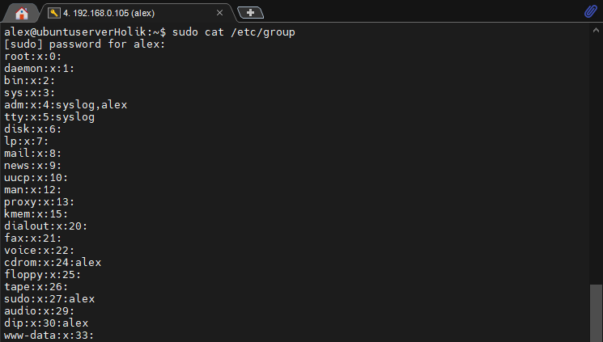  
The /etc/group file is a list of names of groups and group members.  
Each line represents one group and contains four fields:  
* Group name
* Encrypted password or a placeholder
* GID number
* List of members, separated by commas  
To define **pseudo-users** we can look at the third (UID) value in /etc/passwd file.  
All "real" users IDs starting from 1000, lower UIDs are reserved for pseudo-users(e.g root, bin, etc)  
2. **UID** stands for user identifier,  is used to determine which system resources a user can access and to identify the user itself.  
The system UIDs from 0 to 99 should be statically allocated by the system, and shall not be created by applications.  
The system UIDs from 100 to 499 should be reserved for dynamic allocation by system administrators and post install scripts using useradd  
There are several ways to define UID - using /etc/passwd or id command  
3. **GID** are used to define groups in Linux. It can also be found in /etc/passwd file or by using id command.
4. To determine **belonging of user to the specific group** we use groups command with the username:  
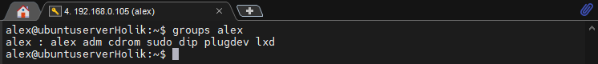  
5. Commands for **adding a user** to the system are useradd and adduser  
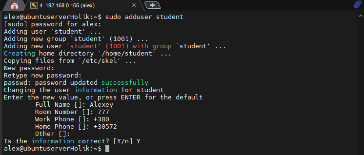  
As we can see, adduser is more user-friendly and interactive. With useradd we can provide parameters manually using keys.  
6. To **change the name of an existing user** we use usermod -l command:  
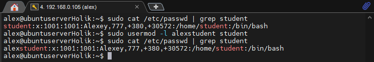
7. **/etc/skel** (from 'skeleton') is used to initiate home directory when a user is first creted.  
This directory is defined in /etc/default/useradd file  
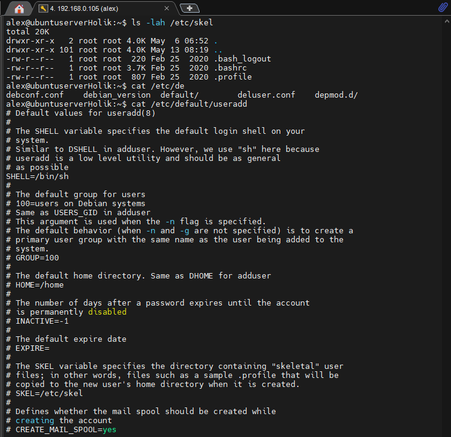
8. To **remove user** from the system with the mailbox we need to use userdel -r command  
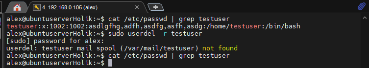
9. To **lock Linux user account** there are 2 alternatives:
* passwd -l 
* usermod -L  
This commands put ! in front of the encrypted password, disabling it  
To **unlock the account** we use either of these two commands with different keys now:
* passwd -u
* usermod -U  
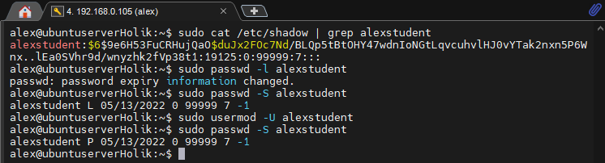
10. To **remove a user's password** and provide him with a pass-free login we use passwd -d command:  
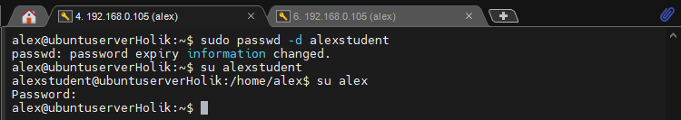
11. To display the extended format of information about the directory we can use ls -l command  
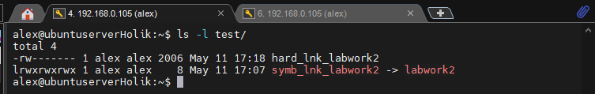  
**Columns:**
* l - soft link
* rwxrwxrwx permissions
* 1 : number of linked hard-links
* alex: owner of the file
* alex: to which group this file belongs to
* 8: size
* May 11 17:07 modification/creation date and time
* file name
12. On a Linux system, each file and directory is assigned access rights for the owner of the file, the members of a group of related users, and everybody else.  
Rights can be assigned to read a file(r), to write a file(w), and to execute a file (x)
13. See q.12. The first rwx part is for the ownder, the second is for the group, the last rwx block is for other users.
14. We use chown command to **change the owner of the file or dir**;    
We use chmod to change the mode of access to the file.  
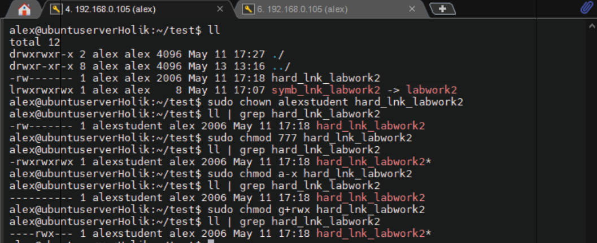
15. **Octal representation of access rights**  
If we want to give all access rights to the file we can use chmod 777 filename  
* 0 (---) No read, write, and execute permissions
* 1 (--x) Only execute permission
* 2 (-w-) Only write permission
* 3 (-wx) Write and execute permissions
* 4 (r--) Only read permission
* 5 (r-x) Read and execute permissions
* 6 (rw-) Read and write permissions
* 8 (rwx) read, write, and execute permissions  
**Umask command** 
We can use umask command to alter the default permissions given to the files we create
16. **Sticky bit** f the sticky bit is set on a directory, the filesystem won’t allow you to delete or rename a file
unless you are the owner of the directory, the owner of the file, or the superuser. Having write
permission on the directory is not enough.  
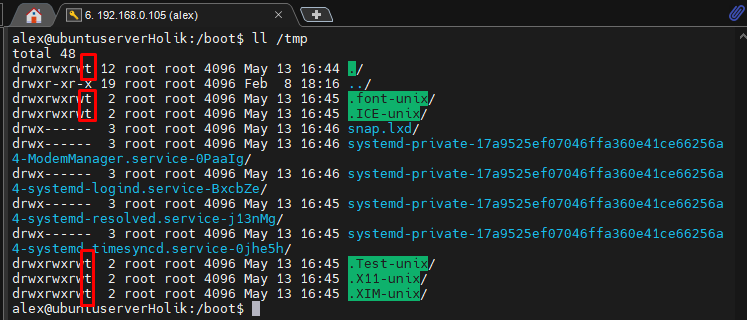
17. **#!** should be presented at the head of a script. The script also should have permission to be executed. 
