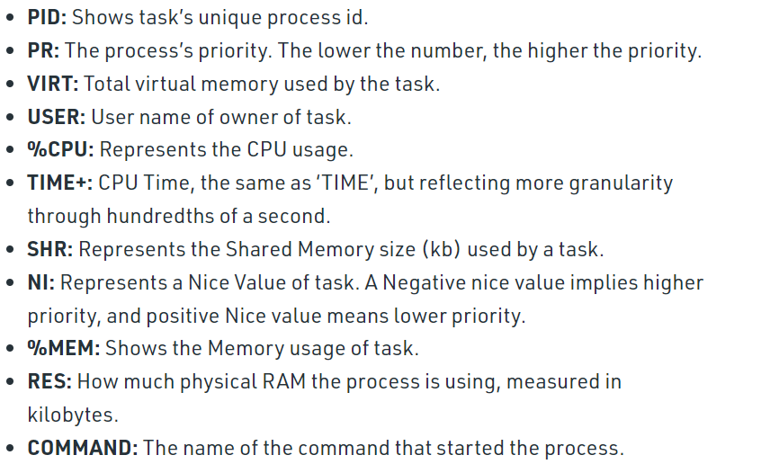
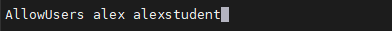

## Task 4.3

### Module 4 Linux Essentials

### Task 3 Part 1

1. The process in Linux could have these 5 states:
   * Running or Runnable (R)
   * Uninterruptible sleep (D)
   * Interruptable sleep (S)
   * Stopped(T)
   * Zombie (Z)
2. To output the chain:  
-s to show parent process  
-p to show PIDs  
-a show CL arguments  
  
3. **proc filesystem** is a virtual(pseudo) filesystem which is createad on a system boot and disappears at time of system shut down.  
It contains information about running processes.  
The proc filesystem also provides communication medium between kernel space and user space  
Each PID of a process has a dedicated directory.
  
ps and top read their process status info from the /proc dir
4. To print **information about the processor** there are many possible commands.  
lscpu, cat /proc/cpuinfo, lshw -C CPU. 

5. ps output with extended information  

6. How to define kernel prosesses and user processes  
https://stackoverflow.com/questions/60410486/is-kthreadd-included-in-the-linux-processes
pstree without parameters shows only the tree of processes spawned by init.  
Kthreadd (2) is a worker thread in kernel address space started by the kernel.
User processes spawned by init, kernel processes spawned by kthread  

7. **list of processes, statuses**  
  
  
8. To display only the processes of a specific user we can use:  
   * ps -u username
   * top -U username  
   
  
9. We can find additional tools for analyzing existing running tasks in ps command help:  
  
   * pgrep (looks  through the currently running processes and lists the process IDs which match the selection criteria to stdout.)   
   * pstree (pstree shows running processes as a tree.)
   * top (displays Linux processes)
   * proc (process information pseudo-filesystem)  
10. **Top command** is used to show the Linux processes in real-time.   
It shows summary system information in the header and lists processes under it.
  
11. To display the processes of the specific user we should use -u key  
  
12. Commands to control **top** command:  
    * z - higlight active processes 
    * d - set new update interval in seconds
    * r - renice; change the priority
    * k - killing the process
    * c - view absolute path of processes  
13. **Sorting**  
    * M - by memory
    * P - by CPU
    * N - by PID
    * T - by running time  
Top displays results in DESC order, to switch - press R  
Another possible was is to use keys, f.e top -o %CPU  

14. **Priority**  
Processes with a higher priority will be executed before those with a lower priority,  
while processes with the same priority are scheduled one after the next, repeatedly.
The niceness of a process is a flag to the kernel about how the process should be worked out in relation to other processes.  
The term nice is derived from the fact that it determines how nice you are going to be to other users of the system.  
A high value of neceness means a low priority for your process - you are nice.  
A low or negative value means high priority - you are not very nice.
Linux nice priority range is -20(highest priority) to +19(lowest priority)  
Commands - nice and renice. Changes made with renice command are only applicable until the next reboot.  
You can set the default nice value of a particular user or group in the /etc/security/limits.conf file  
  
NI - is the nice value, user-space concept  
PR or PRI - the process's actual priority, as seen by the Linux kernel
15. **Top priority change**  
press r. Give PID value of the process you want to change the process value. Give renice value (from -20 to +19)
16. Signals are process-level interrupt requests. List of some signals:  
  
The full list of signals:  
  
kill command can send any signal but by default it sends a TERM.  
The command kill -9 PID guarantees that the process will die because signal 9(KILL) cannot be caught.  
  
17. **Jobs**  
Jobs command is used to list the jobs that you are running in the background and in the foreground.
  
**fg** is a command that moves a background process on your current Linux shell to the foreground.  
  
**bg** sends a process running in the foreground to the background in the current shell.  
**nohup** (No Hang Up) - command that runs the process even after logging out from the shell/terminal  

### Task 3 Part 2
1. **OPENSSH commands in MS Windows**  
scp - secure copy of files between two hosts:  
  
ssh - to connect the remote Linux host:  
  
shh-keygen - generate key-pair authentication keys:  

2. To increase the security of connection we need to adjust /etc/ssh/sshd_config file:    
we can change the default port:  
  
configure timeout interval to be set on 5 mins (300 seconds):  
  
to prevent remote logins from users with empty passwords:  
  
limit access to only some users:  
  
To disable logging in through SSH as root:  
  
force using only more secure ssh protocol 2:  
  
use keys authentication only:  
  
3. Keys for encryption in SSH. Implementing 3 of them.  
ssh-keygen is a tool for creating authentication key pairs for SSH.  
SSH supports several public key algorithms for authentication keys:  
   * rsa - an old algorithm based on the difficulty of factoring large numbers.  
   * dsa - is based on the difficulty of computing discrete logarithms.
   * ecdsa - using elliptic curves
   * ed25519  
Here are possible types of keys:  
  
  
  

4. 

