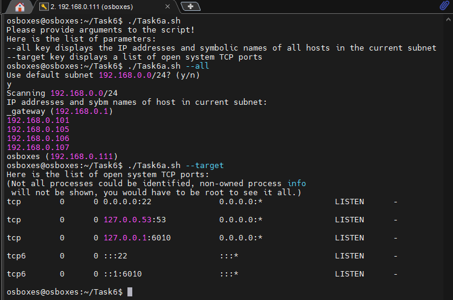

## Task 6

### Module 6 Linux administration with bash

#### Task 6a
[Task6a script](Task6a.sh)  
Script for displaying IP addresses and hostnames in the current subnet and open system TCP ports.
it is possible to enter a subnet if it differs from 192.168.0.1/24  
  

#### Task 6b
[Task6b script](task6b.sh)  
I've created a script to answer the following questions:
1. From which ip were the most requests?
2. What is the most requested page?
3. How many requests were there from each ip?
4. What non-existent pages were clients referred to?
5. What time did site get the most requests?
6. What search bots have accessed the site? (UA + IP)  
  
  

#### Task 6c
[Task6c script](task6c.sh)  
A backup script is taking 2 params: sync directory and backup directory.  
The script checks if the file was deleted from the originating directory, and if yes - pushes that event to the log and delete the file.  
The scripts also add new files to backup directory. For the existing files the script checks the time of modification, if the file in the originating directory is newer, the script pushes the evene "the file was modified" and copies it to the backup directory.  
The script was added to crontab with executing every minute.  
  
