## Task 7.1

### Module 7 Database Administration

### Part1
Database schema  
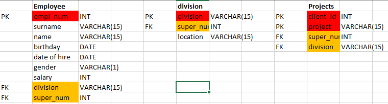  
Tables creation  
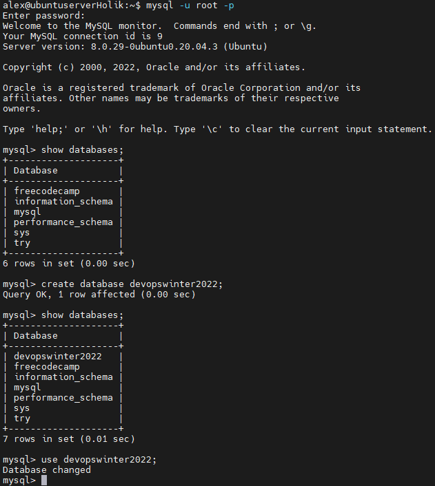  
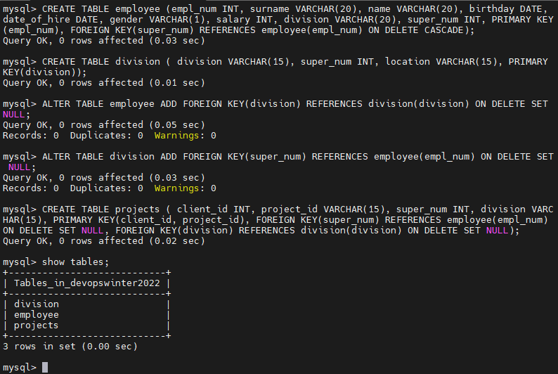
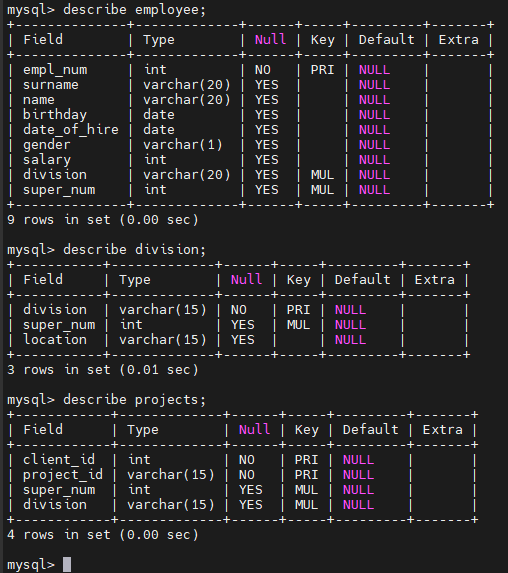    
Filling tables  
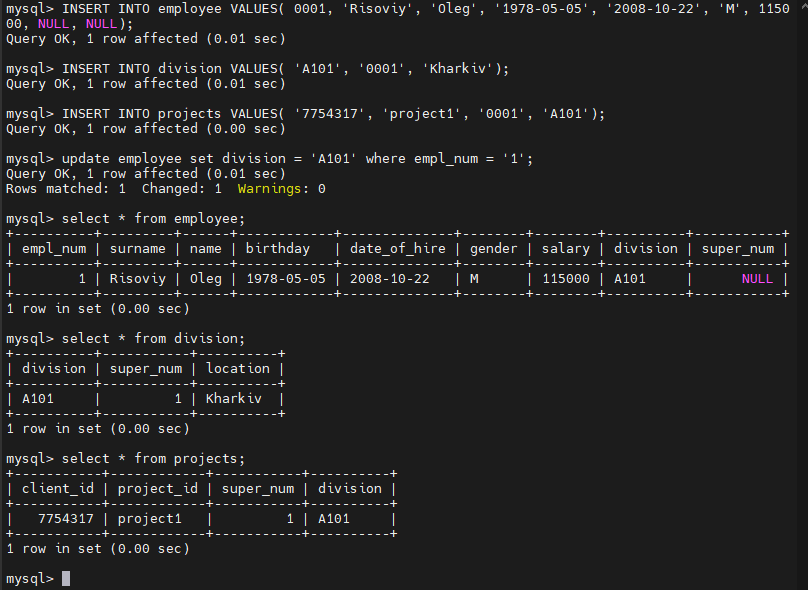
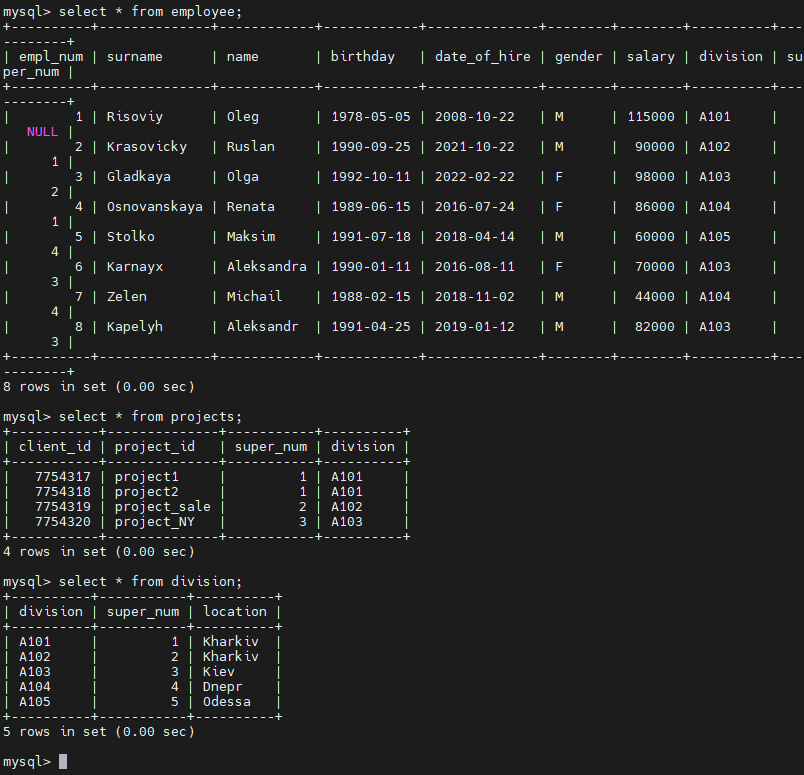  
Executing SELECT operator with WHERE, GROUP BY and ORDER BY  
  
Executing some of SQL queries (DDL, DML, DCL)  
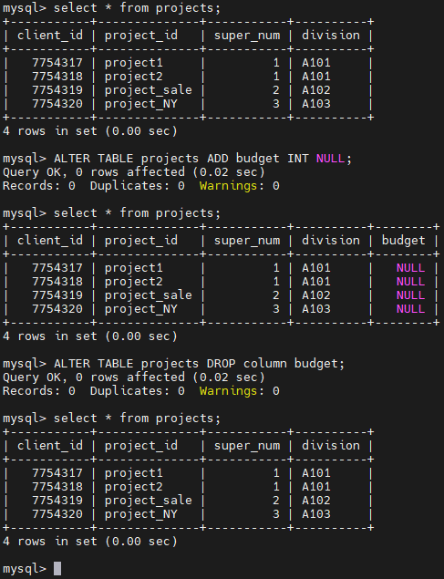
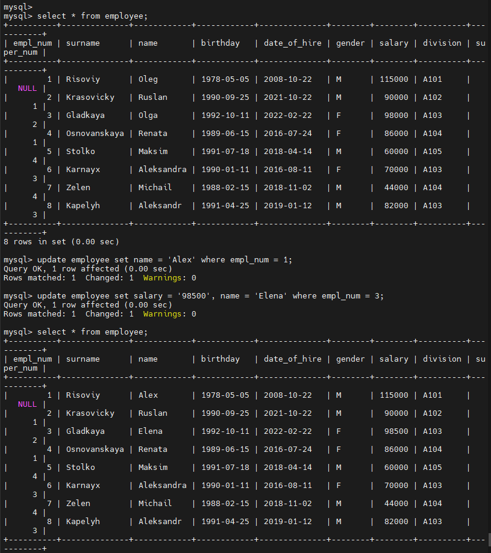  
Playing with priviledges    
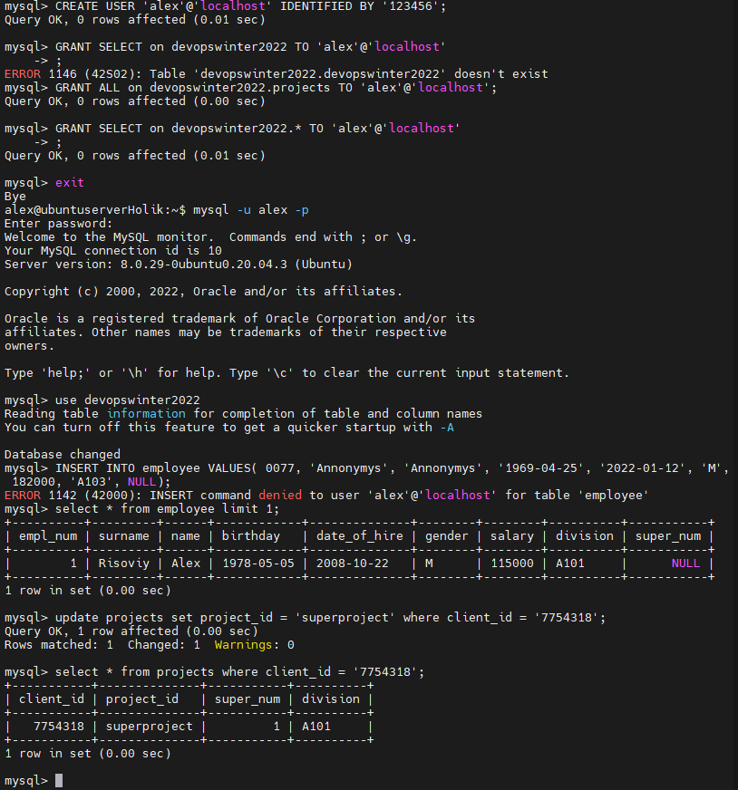

### Part2
Backup (mysqldump)  
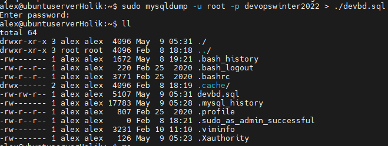  
Delete some info  
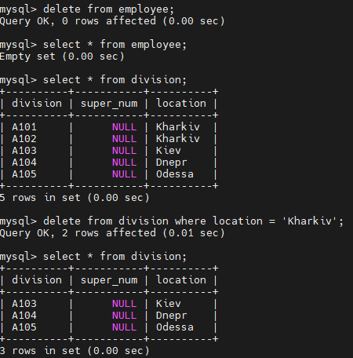  
Restoring the database  
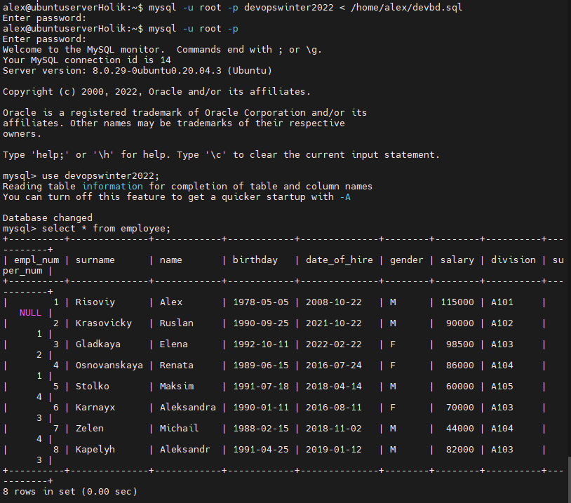
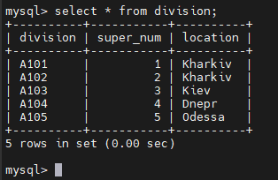  
Transferring local DB to RDS AWS  
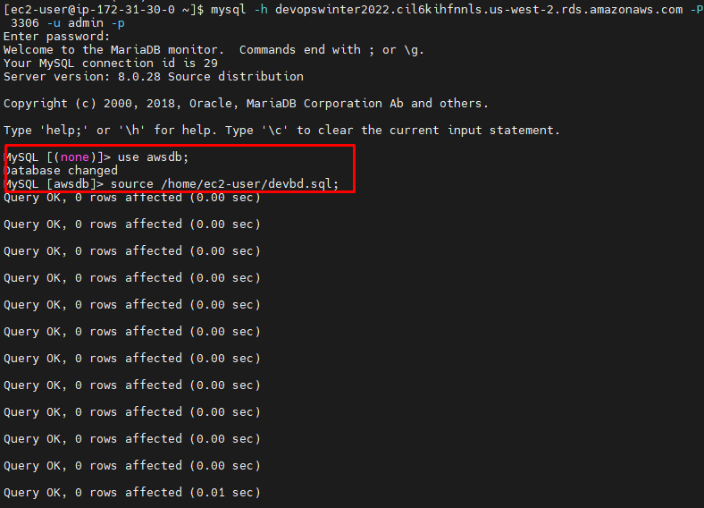  
Selecting  
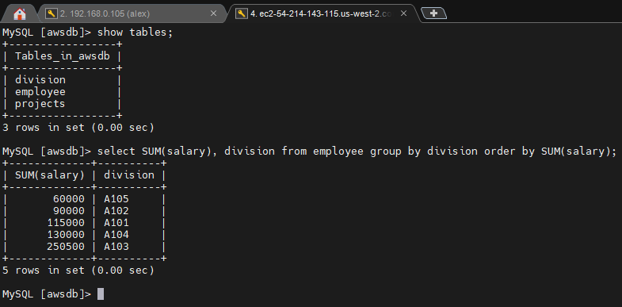  
Creating dump of the DB  
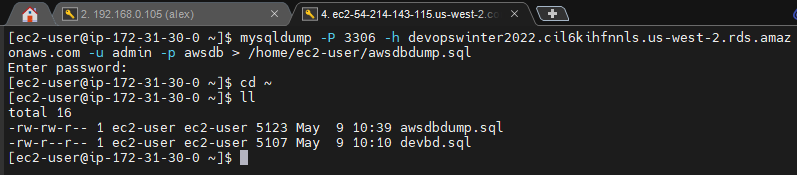  

### Part3
DB creation  
  
Collection creation  
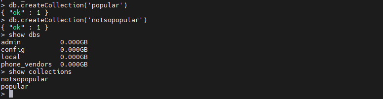  
Documents creation   
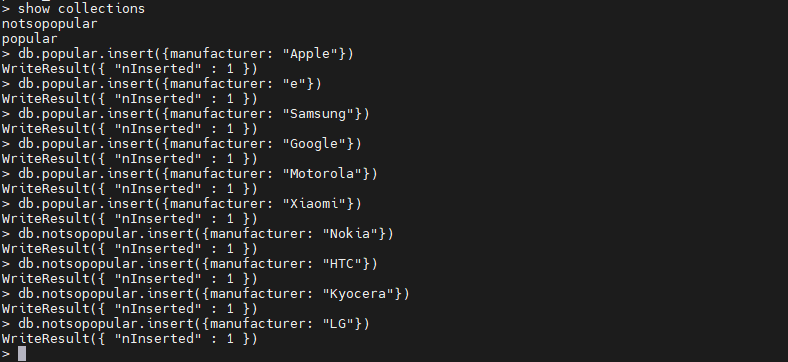  
Using find()  
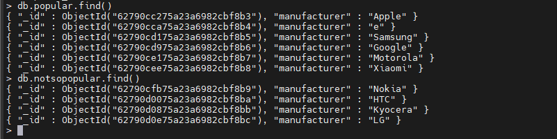

